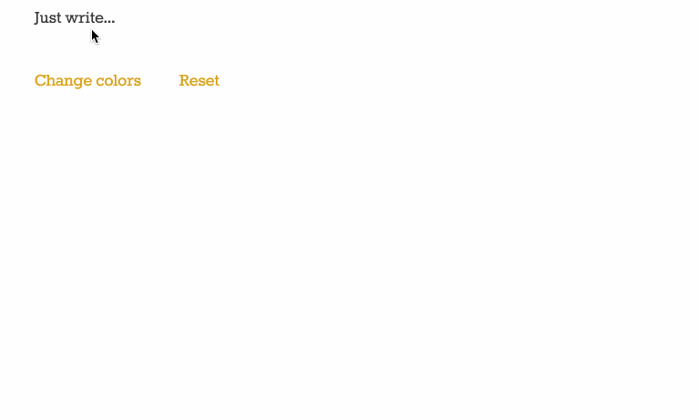

# [Markdown Writer](http://raquelxmoss.github.io/markdown-writer/)

Markdown Writer is a text editor that renders markdown as you go. Live demo coming soon.

## Features

- As-you-go markdown rendering
- Set your own background and text colours
- Text and settings are saved in a cookie, so you can come back to your work at any time
- Word count and duration
- Create and save entries
- Edit entries

## Future features

- Login with Google/Github/Facebook
- Export to .md, .txt, or .html
- Import/Export as JSON
- Choose from a list of fonts
- Choose link colour
- See a list of your entries and select to update/delete
- Share to social media
- Autosaving (& save when you hit cmd + s)
- Pause timer when tab is inactive

## Thank You
- To the fantastic [Internet Typewriter](http://writer.bighugelabs.com) for being _almost_ what I needed, but not quite.
- @casesandberg for the [sweet color pickers](https://github.com/casesandberg/react-color)

